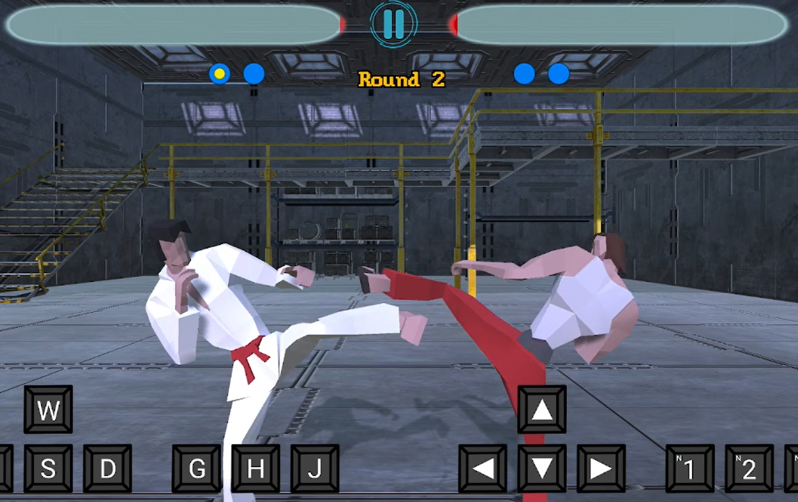

# 프로젝트명: Drug HIT (정완희)

# [목차]
1. [컨셉](#컨셉)
2. [관련 이미지 & 동영상](#관련-이미지--동영상)
3. [대표 이미지](#대표-이미지)
4. [컨셉 & 대표이미지 기반 작품묘사](#컨셉--대표이미지-기반-작품묘사)
5. [Drug Hit 구성요소](#drug-hit-구성요소)
6. [게임 시스템 디자인](#게임-시스템-디자인)
7. [요구사항](#요구사항)
8. [키보드 이벤트 흐름도](#키보드-이벤트-흐름도)

# [컨셉]

## 메인컨셉 : 타격감

- 상대방을 타격하며 얻는 쾌감이 격투게임의 재미 요소라고 생각합니다. 타격 시 효과들에 집중하여 재미요소를 부각시키고 플레이어들이 즐길 수 있도록 합니다.

### 서브 컨셉 1 : 카메라 효과

- 피격 시 카메라가 흔들리거나 체력이 없을 때는 줌인을 하는 등의 효과를 통해 게임에 몰입할 수 있게 하고, 격투의 재미를 높입니다.

### 서브 컨셉 2 : 간단한 조작

- 기존의 격투 게임에는 약한 펀치, 강한 펀치, 약한 킥, 강한 킥으로 키가 많아서 복잡하다고 느꼈습니다. 그래서 주먹, 막기, 킥으로 조작키를 단순하게 하여 캐주얼하게 즐길 수 있습니다.

### 서브 컨셉 3 : 경쟁

- 로컬로 상대와 1대1로 싸우게 되며, 자신의 옆자리 플레이어의 행동을 예측하고 타격하게 되며 승리를 위해 경쟁하게 됩니다. 경쟁을 통해 패배한 플레이어의 승부욕을 자극시키고, 승리한 플레이어는 성취감을 제공합니다.

### 서브 컨셉 4 : 이펙트

- 현실에서도 격투 시합을 볼 때, 피, 땀, 침이 튀는 등의 요소들이 시각적으로 재미을 준다고 생각합니다. 이를 대신하여 충돌하는 위치에서 이펙트가 발생하며 시각적인 재미를 주고자 합니다. 

### 서브 컨셉 5 : 효과음

- 소리 없이 게임을 하다보면 밋밋한 느낌이 들곤 합니다. 효과음을 통해 타격감을 더 부각시키고 청각적인 재미를 줍니다. 더 나아가서 데미지에 따라 소리 크기를 변경하여 낼 수 있도록 구현하고자 합니다.

  

# [관련 이미지 & 동영상]

- 이미지  
  
- 동영상
  

  

# [대표 이미지]

  

# [컨셉 & 대표이미지 기반 작품묘사]

> ### 대표이미지 기반 : 좌측과 우측 상단에는 캐릭터의 얼굴 UI가 표시되며, 체력에 따라 상태가 변합니다. 상단에는 플레이어 체력을 알려주는 체력바가 있으며, 연속된 공격을 하면 1플레이어는 왼쪽에 UI가 표시되고, 2플레이어는 오른쪽에 콤보가 표시됩니다.

> ### 컨셉 기반: 상대를 공격했을 때, 카메라가 흔들리고 파티클, 효과음 등이 발생하여 타격에서 오는 쾌감을 즐길 수 있습니다.

# [Drug HIT 구성요소]
[게임을 한 줄로 요약]
- 실험체들의 상금을 위한 타격

 

## 1. 메커니즘

[도전 과제]

1. 적의 공격을 최대한 막고, 자신의 공격을 성공 시키기
2. 3판 중 2판을 먼저 승리하기

[재미 요소]

1. 타격이나 피격 시, 카메라가 흔들리는 효과
2. 상대방이 체력이 없을 때, 카메라를 줌인하고 슬로우 모션

 

## 2. 이야기

[만들게 된 배경]  
격투 게임 플레이 영상을 보며, 공격 시 파티클과 효과음이 생기고, 슬로우 모션이 나오는 효과들이 게임을 더 즐겁게 만든다는 생각을 하게 되었고 이를 구현하고자 이 게임을 개발하게 되었습니다.

[카메라 관점]  
카메라는 하나를 사용하고, Unity의 포스트 프로세싱을 이용하여 이펙트를 더 화려하게 해서 시각적인 재미를 주려고 합니다.

[배경 스토리]
제약회사 '메가코퍼레이션'은 신체를 강화하는 약을 개발했지만, 납품하기 위해서는 사람을 대상으로 임상실험을 통과해야 했다. 피험자가 나오지 않자 '메가코퍼레이션'은 이 약을 사용한다는 조건으로 격투 대회를 열었고, 큰 상금을 걸었다.
 

## 3. 미적요소

[이펙트]  
전투 시 약 모양의 파티클을 생성 같은 배경 이야기와 연관되는 요소를 추가하려고 합니다.

[음향]  
상대를 타격할 때, 효과음이 나며 게임에 몰입하여 직접 타격하는 느낌을 주려고 합니다.
 

## 4. 기술
Unity의 Post Processing을 이용하여 배경을 꾸미고, 이펙트를 부각될 수 있도록 합니다.

# [게임 시스템 디자인]
## 1. 게임 오브젝트 분해
|연번|오브젝트 이름|오브젝트 이미지|
|:----:|:----:|:----:|
|1|player1||
|2|player2||
|3|게임시작 버튼||
|4|게임방법 버튼||
|5|플레이어1,2 캐릭터 선택완료 버튼||
|6|캐릭터 선택 버튼||
|7|일시정지 버튼||
|8|선택된 캐릭터 표시 UI||
|9|플레이어1,2 체력바||
|10|플레이어1,2 콤보 표시||
|11|게임카메라||
|12|승패 및 라운드 관리||
|13|히트매니저

## 2. 파라미터
### 1) 오브젝트 이름: player1, player2
|속성|영문명칭|설명|
|----|----|----|
|체력|p1hp, p2hp|각 플레이어 체력 수치.|

# [요구사항]

# [키보드 이벤트 흐름도]