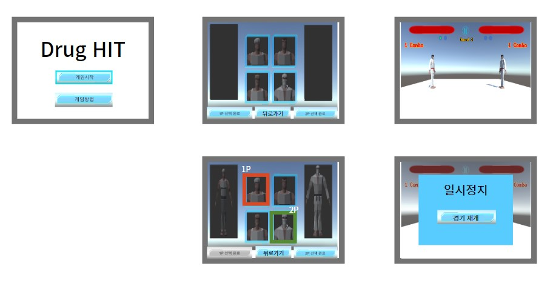

# 프로젝트명: Drug HIT (정완희)

# [목차]

1. [컨셉](#컨셉)
2. [관련 이미지 & 동영상](#관련-이미지--동영상)
3. [대표 이미지](#대표-이미지)
4. [컨셉 & 대표이미지 기반 작품묘사](#컨셉--대표이미지-기반-작품묘사)
5. [Drug Hit 구성요소](#drug-hit-구성요소)
6. [게임 시스템 디자인](#게임-시스템-디자인)
7. [키보드 이벤트 흐름도](#키보드-이벤트-흐름도)
8. [스토리보드](#스토리보드)
9. [요구사항(1년차)](#요구사항1년차)
10. [요구사항(6주차)](#요구사항6주차)
11. [개발작업 일정](#개발작업-일정)

# [컨셉]

## 메인컨셉 : 타격감

- 상대방을 타격하며 얻는 쾌감이 격투게임의 재미 요소라고 생각합니다. 타격 시 발생하는 파티클, 효과음, 카메라 효과들에 집중하여 타격감을 살리고 플레이어들이 즐길 수 있도록 합니다.

### 서브 컨셉 1 : 카메라 효과

- 피격 시 카메라가 흔들리거나 체력이 없을 때는 줌인을 하는 등의 카메라 효과를 통해 게임에 몰입할 수 있게 하고, 격투 게임의 재미를 높입니다.

### 서브 컨셉 2 : 간단한 조작

- 기존의 격투 게임에는 약한 펀치, 강한 펀치, 약한 킥, 강한 킥으로 키가 많아서 복잡하다고 느꼈습니다. 그래서 주먹, 막기, 킥으로 조작키를 단순하게 하여 캐주얼하게 즐길 수 있습니다.

### 서브 컨셉 3 : 경쟁

- 로컬로 상대와 1대1로 싸우게 되며, 자신의 옆자리 플레이어의 행동을 예측하고 타격하게 되며 승리를 위해 경쟁하게 됩니다. 경쟁을 통해 패배한 플레이어의 승부욕을 자극시키고, 승리한 플레이어는 성취감을 제공합니다.

### 서브 컨셉 4 : 이펙트

- 현실에서도 격투 시합을 볼 때, 피, 땀, 침이 튀는 등의 요소들이 시각적으로 재미을 준다고 생각합니다. 이를 대신하여 충돌하는 위치에서 이펙트가 발생하며 시각적인 재미를 주고자 합니다.

### 서브 컨셉 5 : 효과음

- 소리 없이 게임을 하다보면 밋밋한 느낌이 들곤 합니다. 효과음을 통해 타격감을 더 부각시키고 청각적인 재미를 줍니다. 더 나아가서 데미지에 따라 소리 크기를 변경하여 낼 수 있도록 구현하고자 합니다.

  

# [관련 이미지 & 동영상]

- 이미지  
  
- 동영상
  

  

# [대표 이미지]

  

# [컨셉 & 대표이미지 기반 작품묘사]

### 대표이미지 기반
> 게임화면 좌측과 우측에는 각각 1플레이어가 선택한 캐릭터와 2플레이어가 선택한 캐릭터가 배치됩니다.   상단에는 각 플레이어의 현재 남은 체력을 알 수 있는 체력바, 게임을 일시정지 시키는 일시정지 버튼, 현재 라운드를 알려주는 텍스트 UI, 각 플레이어가 현재 몇 번 승리했는지 알려주는 UI가 배치됩니다.   두 플레이어의 거리가 3보다 작거나 같고 체력이 10이하일 때, 공격 상태면 두 플레이어 사이를 줌인 하고 시간을 느리게 하는 카메라 효과가 나타납니다.   이 게임을 처음 접하는 분들의 접근성을 높일 수 있도록 하단에 조작법을 알려주는 UI가 배치되었습니다.

### 컨셉 기반
> 상대를 공격했을 때, 카메라가 흔들리고 파티클, 효과음 등이 발생하여 타격에서 오는 쾌감과 재미를 느낄 수 있습니다.

# [Drug HIT 구성요소]

[게임을 한 줄로 요약]

- 실험체들의 상금을 위한 타격

 

## 1. 메커니즘

[도전 과제]

1. 적의 공격을 최대한 막고, 자신의 공격을 성공 시키기
2. 3판 중 2판을 먼저 승리하기

[재미 요소]

1. 타격 / 피격 시, 카메라가 흔들리는 효과
2. 타격 / 피격 시 발생하는 애니메이션
3. 타격 시 발생하는 파티클 및 효과음
4. 상대방이 체력이 없을 때, 카메라를 줌인하고 슬로우 모션하는 특수효과

 

## 2. 이야기

[만들게 된 배경]  
격투 게임 플레이 영상을 보며, 공격 시 파티클과 효과음이 생기고, 슬로우 모션이 나오는 효과들이 게임을 더 즐겁게 만든다는 생각을 하게 되어 이를 구현하고 싶었고, 두 사람이 경쟁을 통해서 패자는 승부욕을 가지고 승자는 성취감을 얻으며 게임을 즐기는 모습을 보고 이 게임을 개발하게 되었습니다.

[카메라 관점]  
Unity의 포스트 프로세싱을 이용하여 카메라 효과를 꾸며 시각적인 재미를 주려고 합니다.

[배경 스토리]
제약회사 '메가코퍼레이션'은 신체를 강화하는 약을 개발했지만, 납품하기 위해서는 사람을 대상으로 임상실험을 통과해야 했다. 피험자가 나오지 않자 '메가코퍼레이션'은 이 약을 사용한다는 조건으로 격투 대회를 열었고, 큰 상금을 걸었다.
 

## 3. 미적요소

[카메라]
카메라 줌인, 포스트 프로세싱을 이용한 블러효과 등을 이용하여 전투에 긴장감을 주고 시각적인 재미를 주려고 합니다.

[음향]  
상대를 타격할 때, 효과음이 나며 게임에 몰입하여 직접 타격하는 느낌을 주려고 합니다.
 

## 4. 기술

Unity의 Post Processing을 이용하여 카메라 효과를 꾸밀 계획입니다. 카메라가 흔들릴 때 Blur효과를 적용하고, 슬로우 효과를 줄 때 색상을 변경하는 등의 처리를 통해 시각적인 재미요소를 제공합니다.

Unity의 tag 기능을 이용하여 충돌처리를 할 계획입니다. 플레이어는 상단, 중단, 하단을 공격하거나 막을 수 있습니다.

# [게임 시스템 디자인]

## 1. 게임 오브젝트 분해

| 연번 |          오브젝트 이름           |             오브젝트 이미지              |
| :--: | :------------------------------: | :--------------------------------------: |
|  1   |             player1              |             |
|  2   |             player2              |             |
|  3   |          게임시작 버튼           |            |
|  4   |          게임방법 버튼           |            |
|  5   | 플레이어1,2 캐릭터 선택완료 버튼 |         |
|  6   |         캐릭터 선택 버튼         |  |
|  7   |          일시정지 버튼           |            |
|  8   |      선택된 캐릭터 표시 UI       |         |
|  9   |        플레이어1,2 체력바        |                |
|  10  |      플레이어1,2 콤보 표시       |             |
|  11  |            게임카메라            |             |
|  12  |       승패 및 라운드 관리        |                    -                     |
|  13  |            히트매니저            |                    -                     |

## 2. 파라미터

### 1) 오브젝트 이름: player1, player2

| 속성      | 영문명칭              | 설명                                            |
| --------- | --------------------- | ----------------------------------------------- |
| 최대 체력 | p1MaxHp, p2MaxHp      | 라운드 마다 체력을 초기화 하기 위한 체력 .      |
| 현재 체력 | p1CurHp, p2CurHp      | 각 플레이어 현재 체력.                          |
| 스피드    | p1Speed, p2Speed      | 각 플레이어의 이동 속도.                        |
| 상태      | p1Status,p2Status     | 플레이어의 행동 상태.                           |
| 컬러      | p1Color,p2Color       | 동일한 캐릭터 선택 시, 색을 통해 플레이어 구분. |
| 공격력    | p1AtkPower,p2AtkPower | 각 플레이어의 공격력. 현재 행동에 따라서 변경.  |

### 2) 오브젝트 이름: roundManager (승패 판단, 라운드 체크)

| 속성                             | 영문명칭             | 설명                                                                         |
| -------------------------------- | -------------------- | ---------------------------------------------------------------------------- |
| KO                               | isKO                 | p1hp 혹은 p2hp가 0이 되면 ko 판정.                                           |
| 현재 라운드                      | currentRound         | 현재 진행 중인 라운드.                                                       |
| 승리 라운드 수                   | p1WinCnt,p2WinCnt    | 각 플레이어가 승리한 라운드 기록.                                            |
| 최종 승리 판정                   | isFinishRound        | p1WinCnt나 p2WinCnt가 2가 되면 최종 승리를 판단.                             |
| 다음 라운드로 넘어가는 시간      | stayNextRoundTime    | 라운드가 끝나고 다음 라운드로 넘어갈 때, 잠시 대기하는 시간.                 |
| 다음 라운드로 넘어가는 최대 시간 | stayNextRoundMaxTime | 라운드가 끝나고 다음 라운드로 넘어갈 때, 이 시간과 비교하여 다음으로 넘어감. |

### 3) 오브젝트 이름: hitManager (콤보 체크)

| 속성                      | 영문명칭                    | 설명                                                                                |
| ------------------------- | --------------------------- | ----------------------------------------------------------------------------------- |
| 플레이어 콤보             | p1Combo,p2Combo             | 각 플레이어의 콤보 횟수.                                                            |
| 콤보 UI                   | p1ComboUI,p2ComboUI         | 콤보 시 활성화 할 UI. 플레이어 콤보가 0이면 비활성화, 0보다 크면 활성화.            |
| 콤보 초기화 시간          | comboResetTime              | 플레이어 마지막 공격 시간이 comboResetTime보다 높아지면 플레이어 콤보를 0으로 변경. |
| 플레이어 마지막 공격 시간 | p1LastAtkTime,p2LastAtkTime | 플레이어가 마지막 공격한 시간을 기록.                                               |

### 4) 오브젝트 이름: gameCamera (카메라 제어)

| 속성                | 영문명칭      | 설명                                                             |
| ------------------- | ------------- | ---------------------------------------------------------------- |
| 플레이어 위치       | p1Pos, p2Pos  | 각 플레이어 위치를 통해 카메라가 두 플레이어 사이에 위치하게 함. |
| 카메라 흔들림 정도  | camShakeDeg   | 카메라 흔들림 효과의 정도를 결정.                                |
| 줌인 전 카메라 위치 | defaultCamPos | 줌인 후, 다시 원래 위치로 돌아오기 위한 변수.                    |
| 줌인 정도           | zoomInDeg     | 카메라 줌인을 할 때, 줌인 정도.                                  |

## 3. 행동 뽑아보기

|        | 조작키  |              |
| ------ | ------- | ------------ |
|        | 1P      | 2P           |
| 이동   | W,A,S,D | ↑, ←, ↓, →   |
| 주먹   | G       | 숫자 키패드1 |
| 막기   | H       | 숫자 키패드2 |
| 발차기 | J       | 숫자 키패드3 |

### 1) 오브젝트 이름: player1, player2

| 행동                | 영문명칭   | 설명                                                                                                         |
| ------------------- | ---------- | ------------------------------------------------------------------------------------------------------------ |
| 앞으로 이동         | walk_front | (1p기준)플레이어가 앞쪽(→)으로 이동.                                                                         |
| 뒤로 이동           | walk_back  | (1p기준)플레이어가 뒤쪽(←)으로 이동.                                                                         |
| 가만히 있기         | idle       | 플레이어가 아무 조작을 하지 않은 상태.                                                                       |
| (상단)막기          | hb_pose    | 상단 발차기, 상단 주먹을 방어.                                                                               |
| (중단)막기          | bb_pose    | 중단 발차기, 중단 주먹을 방어. 다른 방향키와 조합하지 않을 경우, 기본적으로 중단 막기.                       |
| (하단)막기          | lb_pose    | 하단 발차기, 하단 주먹을 방어.                                                                               |
| (상단)공격 경직     | ha_pose    | 상단 공격 시, 상대가 상단 막기를 하여 공격이 실패한 경우 경직된 상태.                                        |
| (중단)공격 경직     | ba_pose    | 중단 공격 시, 상대가 중단 막기를 하여 공격이 실패한 경우 경직된 상태.                                        |
| (하단)공격 경직     | la_pose    | 하단 공격 시, 상대가 하단 막기를 하여 공격이 실패한 경우 경직된 상태.                                        |
| (상단)피격 경직     | hd_pose    | 상대 플레이어가 상단 공격 시, 상단 막기를 실패할 경우.                                                       |
| (중단)피격 경직     | bd_pose    | 상대 플레이어가 중단 공격 시, 중단 막기를 실패할 경우.                                                       |
| (하단)피격 경직     | ld_pose    | 상대 플레이어가 하단 공격 시, 하단 막기를 실패할 경우.                                                       |
| (상단)가드 경직     | hg_pose    | 상대가 상단 공격 시, 상단 막기를 성공한 경우                                                                 |
| (중단)가드 경직     | bg_pose    | 상대가 중단 공격 시, 중단 막기를 성공한 경우                                                                 |
| (하단)가드 경직     | lg_pose    | 상대가 하단 공격 시, 하단 막기를 성공한 경우                                                                 |
| (상단)왼쪽 발차기   | hk_left    | ↑+발차기 키를 1회 입력 시 공격. (데미지 : 15)                                                                |
| (상단)오른쪽 발차기 | hk_right   | ↑+발차기 키를 연속 입력 시 공격. (데미지 : 18)                                                               |
| (중단)왼쪽 발차기   | bk_left    | 발차기 키를 1회 입력 시 공격. 다른 방향키와 조합하지 않을 경우, 기본적으로 중단 발차기가 나감. (데미지 : 10) |
| (중단)오른쪽 발차기 | bk_right   | 발차기 키를 연속 입력 시 공격. (데미지 : 13)                                                                 |
| (하단)왼쪽 발차기   | lk_left    | ↓+발차기 키를 1회 입력 시 공격. (데미지 : 6)                                                                 |
| (하단)오른쪽 발차기 | lk_right   | ↓+발차기 키를 연속 입력 시 공격. (데미지 : 9)                                                                |
| (상단)왼쪽 주먹     | hp_left    | 주먹 키를 1회 입력 시 공격. 다른 방향키와 조합하지 않을 경우, 기본적으로 상단 주먹이 나감.(데미지 : 4)       |
| (상단)오른쪽 주먹   | hp_right   | 주먹 키를 연속 입력 시 공격. (데미지 : 5)                                                                    |
| (중단)왼쪽 주먹     | bp_left    | ↓+주먹 키를 1회 입력 시 공격. (데미지 : 6)                                                                   |
| (중단)오른쪽 주먹   | bp_right   | ↓+주먹 키를 연속 입력 시 공격. (데미지 : 7)                                                                  |
| 승리 포즈           | win_pose   | 이겼을 때 실행되는 행동.                                                                                     |
| 패배 포즈           | lose_pose  | 졌을 때 실행되는 행동.                                                                                       |

> 모든 공격은 왼쪽 공격이 먼저 나가고 오른쪽 공격이 다음으로 나간다. 즉, 오른쪽 공격은 연속적인 공격을 통해서만 가능하다.

## 4. 상태 뽑아보기

### 1) 오브젝트 이름 : player1, player2

| 현상태                  | 전이상태                        | 전이조건                                                           |
| ----------------------- | ------------------------------- | ------------------------------------------------------------------ |
| 가만히 있기             | 앞으로 이동                     | 1P는 D, 2P는 ←를 입력.                                             |
| 가만히 있기             | 뒤로 이동                       | 1P는 A, 2P는 →를 입력.                                             |
| 가만히 있기             | (상단)막기                      | ↑+막기에 해당하는 키 입력.                                         |
| 가만히 있기             | (중단)막기                      | 막기에 해당하는 키 입력.                                           |
| 가만히 있기             | (하단)막기                      | ↓+막기에 해당하는 키 입력.                                         |
| 가만히 있기             | (상단)피격 경직                 | idle 상태에서 상대의 상단 공격에 맞을 때.                          |
| 가만히 있기             | (중단)피격 경직                 | idle 상태에서 상대의 중단 공격에 맞을 때.                          |
| 가만히 있기             | (하단)피격 경직                 | idle 상태에서 상대의 하단 공격에 맞을 때.                          |
| 가만히 있기             | (상단)왼쪽 발차기               | ↑+발차기에 해당하는 키 입력.                                       |
| 가만히 있기             | (중단)왼쪽 발차기               | 발차기에 해당하는 키 입력.                                         |
| 가만히 있기             | (하단)왼쪽 발차기               | ↓+발차기에 해당하는 키 입력.                                       |
| 가만히 있기             | (상단)왼쪽 주먹                 | 주먹에 해당하는 키 입력.                                           |
| 가만히 있기             | (중단)왼쪽 주먹                 | ↓+주먹에 해당하는 키 입력.                                         |
| 앞으로 이동             | (상단)막기                      | ↑+막기에 해당하는 키 입력.                                         |
| 앞으로 이동             | (중단)막기                      | 막기에 해당하는 키 입력.                                           |
| 앞으로 이동             | (하단)막기                      | ↓+막기에 해당하는 키 입력.                                         |
| 앞으로 이동             | (상단)피격 경직                 | idle 상태에서 상대의 상단 공격에 맞을 때.                          |
| 앞으로 이동             | (중단)피격 경직                 | idle 상태에서 상대의 중단 공격에 맞을 때.                          |
| 앞으로 이동             | (하단)피격 경직                 | idle 상태에서 상대의 하단 공격에 맞을 때.                          |
| 앞으로 이동             | (상단)왼쪽 발차기               | ↑+발차기에 해당하는 키 입력.                                       |
| 앞으로 이동             | (중단)왼쪽 발차기               | 발차기에 해당하는 키 입력.                                         |
| 앞으로 이동             | (하단)왼쪽 발차기               | ↓+발차기에 해당하는 키 입력.                                       |
| 앞으로 이동             | (상단)왼쪽 주먹                 | 주먹에 해당하는 키 입력.                                           |
| 앞으로 이동             | (중단)왼쪽 주먹                 | ↓+주먹에 해당하는 키 입력.                                         |
| 뒤로 이동               | (상단)막기                      | ↑+막기에 해당하는 키 입력.                                         |
| 뒤로 이동               | (중단)막기                      | 막기에 해당하는 키 입력.                                           |
| 뒤로 이동               | (하단)막기                      | ↓+막기에 해당하는 키 입력.                                         |
| 뒤로 이동               | (상단)피격 경직                 | idle 상태에서 상대의 상단 공격에 맞을 때.                          |
| 뒤로 이동               | (중단)피격 경직                 | idle 상태에서 상대의 중단 공격에 맞을 때.                          |
| 뒤로 이동               | (하단)피격 경직                 | idle 상태에서 상대의 하단 공격에 맞을 때.                          |
| 뒤로 이동               | (상단)왼쪽 발차기               | ↑+발차기에 해당하는 키 입력.                                       |
| 뒤로 이동               | (중단)왼쪽 발차기               | 발차기에 해당하는 키 입력.                                         |
| 뒤로 이동               | (하단)왼쪽 발차기               | ↓+발차기에 해당하는 키 입력.                                       |
| 뒤로 이동               | (상단)왼쪽 주먹                 | 주먹에 해당하는 키 입력.                                           |
| 뒤로 이동               | (중단)왼쪽 주먹                 | ↓+주먹에 해당하는 키 입력.                                         |
| (상단)막기              | (상단)가드 경직                 | 상대가 상단 공격 시, 상단 막기에 성공했을 경우.                    |
| (중단)막기              | (중단)가드 경직                 | 상대가 중단 공격 시, 중단 막기에 성공했을 경우.                    |
| (하단)막기              | (하단)가드 경직                 | 상대가 하단 공격 시, 하단 막기에 성공했을 경우.                    |
| (상단)왼쪽 발차기       | (상단)오른쪽 발차기             | 상단발차기 연속 입력 시 발동.                                      |
| (중단)왼쪽 발차기       | (중단)오른쪽 발차기             | 중단발차기 연속 입력 시 발동.                                      |
| (하단)왼쪽 발차기       | (하단)오른쪽 발차기             | 하단발차기 연속 입력 시 발동.                                      |
| (상단)왼쪽 주먹         | (상단)오른쪽 주먹               | 상단주먹 연속 입력 시 발동.                                        |
| (중단)왼쪽 주먹         | (중단)오른쪽 주먹               | 중단주먹 연속 입력 시 발동.                                        |
| (상, 중단)왼쪽 주먹     | (상,중,하단)오른쪽 발차기       | 상단 혹은 중단 주먹 입력 후, 상단/중단/하단 발차기 입력.           |
| (상단)왼쪽 주먹         | (상단, 중단)오른쪽 주먹         | 상단 왼쪽 주먹 입력 후, 상단/중단 주먹 입력.                       |
| (상,중,하단)공격        | (상,중,하단)공격 경직           | 상,중,하단 공격 시, 상대가 상,중,하단 막기에 성공한 경우.          |
| (상, 중, 하단)가드 경직 | (상, 중, 하단)공격(발차기/주먹) | 상대가 상, 중, 하단 공격 시, 막기에 성공했을 경우, 다음 공격 가능. |
| 가만히 있기             | 승리 포즈                       | 상대 체력이 자신 체력보다 먼저 0보다 낮아졌을 때.                  |
| 가만히 있기             | 패배 포즈                       | 상대 체력보다 자신 체력이 먼저 0보다 낮아졌을 때.                  |

### 2) 애니메이션 상태에 따른 히트박스 활성화 타이밍

## 5. 게임의 규칙

### 1) 핵심 규칙

- 좌측은 1플레이어(1P), 우측은 2플레이어(2P)로 구성됨.
- 두 플레이어 중 체력이 0이하가 되면 라운드가 종료되며, 먼저 2라운드를 승리한 플레이어가 최종 승리.

### 2) 보조 규칙

- 플레이어는 맵을 벗어날 수 없음.
- 카메라는 두 플레이어를 모두 나타냄.
- 두 플레이어가 같은 캐릭터 선택 시, 구분을 위해 색을 변경.
- 무승부의 경우는 재경기를 진행.
- 히트 발생 시, 카메라에 흔들리는 효과 적용.
- 두 플레이어 모두 체력이 적고, 가까운 거리에서 서로 공격을 하고 있을 때 카메라를 줌인하고 슬로우 모션 적용.
- 타격이 발생할 때, 효과음과 파티클 생성.

### 6. 게임에서 사용될 공식

- 공격/피격 : 피격당한 플레이어 체력 - 공격 플레이어의 공격력

- 카운터 공격 : 기본 공격력 \* 1.5

# [키보드 이벤트 흐름도]

# [스토리보드]

# [요구사항(1년차)]

## 게임 화면 구성

14. ~~게임화면에는 플레이어1,2의 체력바, 일시정지 버튼, 콤보표시UI, 플레이어1,2의 캐릭터로 구성된다.~~
15. ~~title 화면 이미지 변경~~

### 플레이어 조작

15. ~~플레이어1은 좌측에, 플레이어2는 우측에 배치된 캐릭터를 조작한다.~~
16. ~~플레이어가 이동키를 사용하면 캐릭터가 이동한다.~~
17. ~~이동 시 캐릭터 상태를 변경한다.~~
18. ~~1P와 2P가 서로 넘어가는 일이 일어나지 않도록 위치를 조정한다.~~
19. ~~플레이어 주먹 공격 시 상태를 변경한다.~~
20. ~~플레이어 막기 시 상태를 변경한다.~~
21. ~~플레이어 발차기 시 상태를 변경한다.~~
22. ~~키 씹힘 문제 수정~~

### 애니메이션

18. ~~플레이어가 주먹 공격 조작 시, 주먹 공격 애니메이션이 실행된다.~~
19. ~~플레이어가 발차기 공격 조작 시, 발차기 공격 애니메이션이 실행된다.~~
20. ~~플레이어가 방어 조작 시, 방어 동작 애니메이션이 실행된다.~~
21. ~~데미지 받을 경우, 피격 애니메이션이 실행된다.~~
22. ~~사망 애니메이션 즉시 실행~~

### 충돌처리

20. ~~상대 히트박스와 충돌 시, 플레이어 현재 상태를 변경한다.~~
21. ~~캐릭터 애니메이션에 따라 충돌처리할 히트박스를 활성화, 비활성화 한다.~~
22. ~~히트박스에 따라서 데미지 계산을 한다.~~
23. ~~충돌처리 발생 시, 충돌 위치에 파티클을 생성한다.~~
24. ~~충돌처리 발생 시, 효과음이 발생한다.~~

### UI

23. ~~플레이어 체력이 줄어들면, 체력UI의 게이지도 줄어든다.~~
24. ~~승리한 라운드를 표시하는 UI를 활성화한다.~~
25. ~~일시정지 상태가 되면 버튼을 활성화 한다. 활성화 된 버튼을 누르면 일시정지가 해제된다.~~
26. ~~현재 라운드 수를 텍스트 UI에 표시한다.~~

### 카메라

24. ~~카메라는 플레이어1과 플레이어2를 비춘다.~~
25. ~~두 플레이어가 맵 밖으로 나가는 것을 방지한다.~~
26. ~~두 플레이어가 카메라 밖으로 나가는 것을 방지하기 위해, 두 플레이어 위치를 이용하여 카메라를 이동시킨다.~~
27. ~~충돌이 일어나면 camShakeDeg만큼 카메라를 흔드는 효과를 준다.~~
28. ~~두 플레이어 체력이 5보다 낮은 상황에서 두 캐릭터 거리가 1 이하인 경우, 서로 공격하고 있으면 슬로우 효과를 주고 줌인을 한다.~~

### 라운드 매니저

29. ~~라운드가 종료되면 승패를 판단하고 다음 라운드로 넘어간다.~~
30. ~~게임 중 일시정지 버튼을 누를 시, 게임을 잠시 멈춘다.~~
31. ~~2판을 이긴 플레이어가 있는 경우, 시작화면으로 넘어간다.~~
32. ~~라운드 종료 시 즉시 체력 차는 것 수정~~

### 사운드

33. ~~BGM 추가~~

---

### 씬 구성 및 이동

32. 시작화면, 게임연습 화면, 게임캐릭터 선택화면, 게임화면 총 4개의 화면이 있다.
33. 시작화면에는 게임시작과 게임방법 버튼, 게임끝내기 버튼 3개가 있다.
34. 게임시작 클릭 시, 게임캐릭터 선택화면으로 넘어간다.
35. 게임방법 클릭 시, 게임연습 화면으로 넘어간다.
36. 게임캐릭터 선택화면에서는 캐릭터 이미지가 담겨있는 4가지 버튼, 플레이어1이 캐릭터 선택완료 시 클릭할 버튼, 플레이어2가 캐릭터 선택완료 시 클릭할 버튼, 캐릭터가 선택되었을 때 캐릭터 모습을 보여줄 UI가 배치된다.

### UI

39. 플레이어가 4가지 캐릭터이미지 버튼 중에서 캐릭터를 선택하면, 선택한 캐릭터가 UI에 나타난다.
40. 캐릭터 선택완료 버튼을 누르면, 선택완료 버튼을 비활성화한다.
41. 1P가 캐릭터를 선택하면 선택된 캐릭터 버튼 빨강색으로 변경하고 '1P'라는 텍스트를 띄운다.
42. 1P 선택된 캐릭터가 화면 왼쪽에 표시된다.
43. 1P가 캐릭터를 선택했으면 2P가 캐릭터를 선택한다.
44. 2P가 캐릭터를 선택하면 선택된 캐릭터 버튼을 초록색으로 변경하고 '2P'라는 텍스트를 띄운다.
45. 같은 캐릭터를 선택한 경우, 2P 캐릭터의 색을 변경한다.
46. 2P가 선택한 캐릭터를 화면 오른쪽에 표시한다.
47. 두 플레이어 모두 캐릭터 선택을 마치면 게임화면으로 넘어간다.
48. 연속된 공격을 성공하면 콤보 UI를 활성화한다.
49. 콤보 횟수가 0이 되면 콤보 UI를 비활성화한다.

### 캐릭터 생성

49. 두 플레이어가 선택한 캐릭터를 바탕으로, 게임화면에 캐릭터를 생성한다.

### 카메라

29. 포스트 프로세싱을 사용하여 슬로우 모션일 때, 색상을 변경한다.
30. 포스트 프로세싱을 사용하여 카메라가 흔들릴 때, 블러효과를 준다.

### 콤보 매니저

30. 최종 공격으로 부터 일정 시간이 지나면 콤보를 0으로 변경한다.

# [요구사항(6주차)]

## 게임 화면 구성

14. ~~게임화면에는 플레이어1,2의 체력바, 일시정지 버튼, 콤보표시UI, 플레이어1,2의 캐릭터로 구성된다.~~
15. ~~title 화면 이미지 변경~~

## 플레이어 조작

15. ~~플레이어1은 좌측에, 플레이어2는 우측에 배치된 캐릭터를 조작한다.~~
16. ~~플레이어가 이동키를 사용하면 캐릭터가 이동한다.~~
17. ~~이동 시 캐릭터 상태를 변경한다.~~
18. ~~1P와 2P가 서로 넘어가는 일이 일어나지 않도록 위치를 조정한다.~~
19. ~~플레이어 주먹 공격 시 상태를 변경한다.~~
20. ~~플레이어 막기 시 상태를 변경한다.~~
21. ~~플레이어 발차기 시 상태를 변경한다.~~
22. ~~키 씹힘 문제 수정~~

## 애니메이션

18. ~~플레이어가 주먹 공격 조작 시, 주먹 공격 애니메이션이 실행된다.~~
19. ~~플레이어가 발차기 공격 조작 시, 발차기 공격 애니메이션이 실행된다.~~
20. ~~플레이어가 방어 조작 시, 방어 동작 애니메이션이 실행된다.~~
21. ~~데미지 받을 경우, 피격 애니메이션이 실행된다.~~
22. ~~사망 애니메이션 즉시 실행~~

## 충돌처리

20. ~~상대 히트박스와 충돌 시, 플레이어 현재 상태를 변경한다.~~
21. ~~캐릭터 애니메이션에 따라 충돌처리할 히트박스를 활성화, 비활성화 한다.~~
22. ~~히트박스에 따라서 데미지 계산을 한다.~~
23. ~~충돌처리 발생 시, 충돌 위치에 파티클을 생성한다.~~
24. ~~충돌처리 발생 시, 효과음이 발생한다.~~

## UI

23. ~~플레이어 체력이 줄어들면, 체력UI의 게이지도 줄어든다.~~
24. ~~승리한 라운드를 표시하는 UI를 활성화한다.~~
25. ~~일시정지 상태가 되면 버튼을 활성화 한다. 활성화 된 버튼을 누르면 일시정지가 해제된다.~~
26. ~~현재 라운드 수를 텍스트 UI에 표시한다.~~

## 카메라

24. ~~카메라는 플레이어1과 플레이어2를 비춘다.~~
25. ~~두 플레이어가 맵 밖으로 나가는 것을 방지한다.~~
26. ~~두 플레이어가 카메라 밖으로 나가는 것을 방지하기 위해, 두 플레이어 위치를 이용하여 카메라를 이동시킨다.~~
27. ~~충돌이 일어나면 camShakeDeg만큼 카메라를 흔드는 효과를 준다.~~
28. ~~두 플레이어 체력이 5보다 낮은 상황에서 두 캐릭터 거리가 1 이하인 경우, 서로 공격하고 있으면 슬로우 효과를 주고 줌인을 한다.~~

## 라운드 매니저

29. ~~라운드가 종료되면 승패를 판단하고 다음 라운드로 넘어간다.~~
30. ~~게임 중 일시정지 버튼을 누를 시, 게임을 잠시 멈춘다.~~
31. ~~2판을 이긴 플레이어가 있는 경우, 시작화면으로 넘어간다.~~
32. ~~라운드 종료 시 즉시 체력 차는 것 수정~~

### 사운드

33. ~~BGM 추가~~

 

# [개발작업 일정]

## 1주차

#### 게임 화면 구성

14. ~~게임화면에는 플레이어1,2의 체력바, 일시정지 버튼, 콤보표시UI, 플레이어1,2의 캐릭터로 구성된다.~~

## 2주차

#### 플레이어 조작

15. ~~플레이어1은 좌측에, 플레이어2는 우측에 배치된 캐릭터를 조작한다.~~
16. ~~플레이어가 이동키를 사용하면 캐릭터가 이동한다.~~
17. ~~이동 시 캐릭터 상태를 변경한다.~~
18. ~~1P와 2P가 서로 넘어가는 일이 일어나지 않도록 위치를 조정한다.~~
19. ~~플레이어 주먹 공격 시 상태를 변경한다.~~
20. ~~플레이어 막기 시 상태를 변경한다.~~
21. ~~플레이어 발차기 시 상태를 변경한다.~~

## 3주차

#### 애니메이션

18. ~~플레이어가 주먹 공격 조작 시, 주먹 공격 애니메이션이 실행된다.~~
19. ~~플레이어가 발차기 공격 조작 시, 발차기 공격 애니메이션이 실행된다.~~
20. ~~플레이어가 방어 조작 시, 방어 동작 애니메이션이 실행된다.~~
21. ~~데미지 받을 경우, 피격 애니메이션이 실행된다.~~

#### 충돌처리

20. ~~상대 히트박스와 충돌 시, 플레이어 현재 상태를 변경한다.~~
21. ~~캐릭터 애니메이션에 따라 충돌처리할 히트박스를 활성화, 비활성화 한다.~~
22. ~~히트박스에 따라서 데미지 계산을 한다.~~
23. ~~충돌처리 발생 시, 충돌 위치에 파티클을 생성한다.~~
24. ~~충돌처리 발생 시, 효과음이 발생한다.~~

## 4주차

#### UI

23. ~~플레이어 체력이 줄어들면, 체력UI의 게이지도 줄어든다.~~
24. ~~승리한 라운드를 표시하는 UI를 활성화한다.~~
25. ~~일시정지 상태가 되면 버튼을 활성화 한다. 활성화 된 버튼을 누르면 일시정지가 해제된다.~~
26. ~~현재 라운드 수를 텍스트 UI에 표시한다.~~

#### 카메라

24. ~~카메라는 플레이어1과 플레이어2를 비춘다.~~
25. ~~두 플레이어가 맵 밖으로 나가는 것을 방지한다.~~
26. ~~두 플레이어가 카메라 밖으로 나가는 것을 방지하기 위해, 두 플레이어 위치를 이용하여 카메라를 이동시킨다.~~
27. ~~충돌이 일어나면 camShakeDeg만큼 카메라를 흔드는 효과를 준다.~~
28. ~~두 플레이어 체력이 5보다 낮은 상황에서 두 캐릭터 거리가 1 이하인 경우, 서로 공격하고 있으면 슬로우 효과를 주고 줌인을 한다.~~

## 5주차

#### 라운드 매니저

29. ~~라운드가 종료되면 승패를 판단하고 다음 라운드로 넘어간다.~~
30. ~~게임 중 일시정지 버튼을 누를 시, 게임을 잠시 멈춘다.~~
31. ~~2판을 이긴 플레이어가 있는 경우, 시작화면으로 넘어간다.~~

## 6주차

1. ~~오류 체크 및 보완~~

- ~~사망 애니메이션 즉시 실행~~
- ~~라운드 종료 시 즉시 체력 차는 것 수정~~
- ~~키 씹힘 문제 수정~~
- ~~BGM 추가~~
- ~~title 화면 이미지 변경~~
